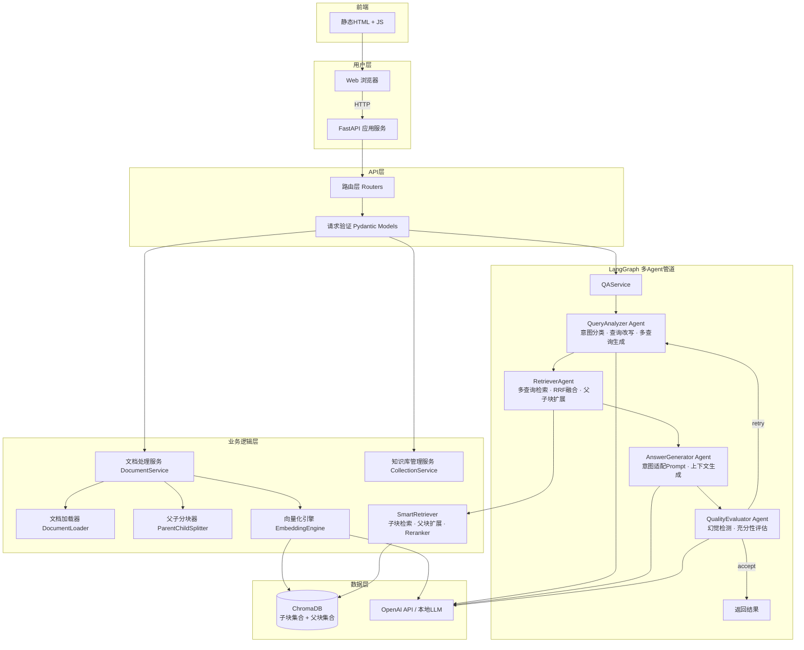
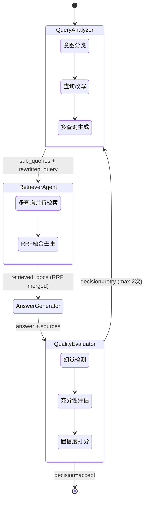
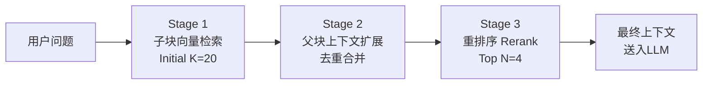
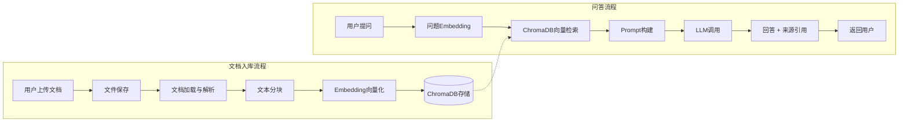

# 智能问答系统（Smart QA RAG）软件设计文档

| 项目名称 | 智能问答系统（Smart QA RAG） |
|---------|---------------------------|
| 仓库名   | smart-qa-rag              |
| 版本     | v1.0.0                    |
| 日期     | 2026-03-18                |
| 状态     | 初稿                       |

---

## 目录

1. [文档概述](#1-文档概述)
2. [系统概述](#2-系统概述)
3. [系统架构设计](#3-系统架构设计)
4. [模块详细设计](#4-模块详细设计)
5. [数据设计](#5-数据设计)
6. [目录结构设计](#6-目录结构设计)
7. [部署设计](#7-部署设计)
8. [非功能性需求](#8-非功能性需求)
9. [测试策略](#9-测试策略)

---

## 1. 文档概述

### 1.1 文档目的

本文档是智能问答系统（Smart QA RAG）的软件设计文档（Software Design Document），旨在全面描述系统的架构设计、模块划分、数据流转、接口定义以及部署方案。本文档作为开发团队实施编码、测试和运维的核心技术参考，确保所有参与方对系统的设计意图和技术细节达成一致理解。

### 1.2 文档范围

本文档覆盖以下范围：

- 系统整体架构与分层设计
- 各功能模块的详细设计，包括文档加载预处理、文本向量化存储、检索增强生成（RAG）、Web API 以及前端界面
- 数据模型与数据库 Schema 设计
- RESTful API 接口的完整定义与示例
- 项目目录结构规范
- Docker 容器化部署方案
- 非功能性需求与测试策略

本文档不涉及项目管理计划、商业需求分析以及用户操作手册。

### 1.3 读者对象

| 角色 | 关注重点 |
|------|---------|
| 后端开发工程师 | 模块详细设计、API 接口定义、数据模型 |
| 前端开发工程师 | API 接口定义、前端界面模块设计 |
| 测试工程师 | 测试策略、API 接口定义、非功能性需求 |
| 运维工程师 | 部署设计、环境变量配置、性能需求 |
| 技术负责人/架构师 | 系统架构设计、技术选型、可扩展性 |

### 1.4 术语定义

| 术语 | 定义 |
|------|------|
| RAG | Retrieval-Augmented Generation，检索增强生成。通过从外部知识库检索相关文档片段，将其作为上下文注入大语言模型的提示中，以提升回答的准确性和可靠性。 |
| Embedding | 文本嵌入，将自然语言文本转化为固定维度的稠密向量表示，用于语义相似度计算。 |
| Chunk | 文档分块，将长文档按一定策略切分为较小的文本片段，以便于向量化和检索。 |
| LLM | Large Language Model，大语言模型，如 OpenAI GPT-4、GPT-3.5-turbo 等。 |
| ChromaDB | 开源向量数据库，用于存储和检索文本嵌入向量。 |
| LangChain | 一个用于构建基于 LLM 应用的开源框架，提供链式调用、文档加载、向量存储等抽象封装。 |
| Collection | ChromaDB 中的集合概念，类似于关系数据库中的表，用于组织和隔离不同知识库的向量数据。 |
| Top-K | 检索时返回相似度最高的前 K 个文档片段。 |

---

## 2. 系统概述

### 2.1 系统背景

在企业知识管理场景中，大量业务文档（产品手册、技术文档、FAQ 等）分散存储在不同系统中，员工和客户难以快速定位所需信息。传统的关键字搜索无法理解自然语言语义，搜索结果的相关性和准确性有限。

智能问答系统（Smart QA RAG）利用检索增强生成技术，将企业文档知识库与大语言模型结合，使用户能够以自然语言提问的方式获取精准答案，同时提供答案来源的文档引用，增强回答的可信度和可追溯性。

### 2.2 系统目标

1. **多格式文档接入**：支持 PDF、TXT、DOCX、Markdown 四种主流文档格式的自动加载与解析。
2. **语义化检索**：基于向量相似度的语义检索，突破关键字匹配的局限性，理解用户问题的真实意图。
3. **准确回答生成**：结合检索到的相关文档片段和大语言模型的推理能力，生成准确、连贯、有据可依的自然语言回答。
4. **来源引用**：每个回答附带所引用的文档来源信息，便于用户验证和深入阅读。
5. **易用的交互界面**：提供简洁的聊天式 Web 界面，降低使用门槛。
6. **易于部署**：支持 Docker 一键部署，配置简单。

### 2.3 核心功能描述

| 功能 | 描述 |
|------|------|
| 文档上传与管理 | 用户通过 API 或界面上传文档，系统自动解析、分块、向量化并存入知识库 |
| 知识库管理 | 支持创建多个知识库（Collection），对文档进行分类管理，支持文档删除 |
| 智能问答 | 用户输入自然语言问题，系统检索相关文档片段，调用 LLM 生成回答 |
| 对话历史 | 维护当前会话的对话历史，支持多轮上下文连贯对话 |
| 来源追溯 | 回答中包含引用的文档来源（文件名、页码、相关片段） |

---

## 3. 系统架构设计

### 3.1 总体架构图



### 3.1.1 LangGraph Agent 管道详细流程



### 3.2 分层架构说明

系统采用经典的三层架构设计，各层职责清晰，层间通过接口解耦。

#### 3.2.1 API 层（Presentation Layer）

API 层负责处理所有外部 HTTP 请求，是系统与用户交互的唯一入口。

- **FastAPI 框架**：提供高性能的异步 HTTP 服务，自动生成 OpenAPI 文档。
- **路由模块**：按功能域划分路由（文档管理、问答、知识库管理），遵循 RESTful 设计规范。
- **请求/响应模型**：使用 Pydantic 模型进行请求参数校验和响应序列化，确保数据的类型安全和完整性。
- **中间件**：包括 CORS 跨域处理、请求日志记录、全局异常处理和速率限制。
- **静态文件服务**：挂载前端静态资源，使前后端在同一服务中部署。

#### 3.2.2 业务逻辑层（Business Logic Layer）

业务逻辑层是系统的核心，封装所有业务规则和处理流程。

- **文档处理服务（DocumentService）**：协调文档从上传到入库的完整流水线——文件解析、文本提取、分块处理、向量化、写入向量数据库。
- **问答服务（QAService）**：接收用户问题，执行语义检索获取相关文档片段，构建 Prompt，调用 LLM 生成回答，组装最终响应（含来源引用）。
- **知识库管理服务（CollectionService）**：管理 ChromaDB 中的 Collection 生命周期，包括创建、列表查询、删除及统计信息获取。

#### 3.2.3 数据层（Data Layer）

数据层负责所有数据的持久化存储和外部服务调用。

- **ChromaDB**：作为向量数据库，存储文档片段的嵌入向量及元数据。支持持久化模式，数据存储在本地文件系统。
- **Embedding 模型**：通过 OpenAI Embedding API（text-embedding-3-small）或兼容的本地模型，将文本转为向量。
- **LLM 服务**：调用 OpenAI GPT-3.5-turbo / GPT-4 或兼容的本地模型接口，生成自然语言回答。

### 3.3 技术选型及理由

| 技术 | 选型 | 理由 |
|------|------|------|
| 编程语言 | Python 3.11+ | AI/ML 生态成熟，LangChain 等框架原生支持，异步能力通过 asyncio 满足 Web 服务需求 |
| Web 框架 | FastAPI 0.110+ | 原生 async 支持、自动 OpenAPI 文档、Pydantic 集成验证、性能优于 Flask/Django REST |
| LLM 编排 | LangChain 0.2+ | 提供成熟的文档加载器、文本分块器、向量存储抽象和 LLM 调用链，大幅减少样板代码 |
| 向量数据库 | ChromaDB 0.5+ | 轻量级、Python 原生、嵌入式部署零运维、支持持久化存储，适合中小规模知识库 |
| Embedding 模型 | OpenAI text-embedding-3-small | 1536 维向量，性价比高，语义理解能力强；可配置切换为本地模型 |
| LLM | OpenAI GPT-3.5-turbo / GPT-4 | 中文理解能力强，推理质量高；通过配置可切换为其他兼容 API |
| 前端 | 原生 HTML + CSS + JavaScript | 需求简单（聊天界面），无需引入重型前端框架，减少构建复杂度 |
| 容器化 | Docker + Docker Compose | 标准化部署、环境隔离、一键启动 |

---

## 4. 模块详细设计

### 4.1 文档加载与预处理模块

#### 4.1.1 模块职责

负责从用户上传的文件中提取纯文本内容，并将其切分为适合向量化的文档片段。

#### 4.1.2 支持的文件格式

| 格式 | 加载器 | 说明 |
|------|--------|------|
| PDF | `PyPDFLoader` | 逐页解析，保留页码信息作为元数据 |
| TXT | `TextLoader` | 直接读取纯文本，使用 UTF-8 编码 |
| DOCX | `Docx2txtLoader` | 提取 Word 文档中的纯文本内容 |
| Markdown | `UnstructuredMarkdownLoader` | 解析 Markdown 结构，保留标题层级信息 |

#### 4.1.3 文档加载器设计

```python
# app/services/document_loader.py

class DocumentLoaderFactory:
    """根据文件扩展名选择合适的文档加载器"""

    LOADER_MAP = {
        ".pdf": PyPDFLoader,
        ".txt": TextLoader,
        ".docx": Docx2txtLoader,
        ".md": UnstructuredMarkdownLoader,
    }

    @staticmethod
    def get_loader(file_path: str) -> BaseLoader:
        ext = Path(file_path).suffix.lower()
        loader_cls = DocumentLoaderFactory.LOADER_MAP.get(ext)
        if loader_cls is None:
            raise UnsupportedFileTypeError(f"不支持的文件格式: {ext}")
        return loader_cls(file_path)
```

#### 4.1.4 分块策略：父子分块（Parent-Child Chunking）

系统采用**两层层级分块**策略，取代传统的扁平分块方式，以同时兼顾**检索精度**与**上下文完整性**：

**核心思想：**
- **子块（Child Chunk）** — 较小的文本片段（默认 300 字），用于向量化和语义检索。小粒度使得匹配更精确。
- **父块（Parent Chunk）** — 较大的文本片段（默认 1500 字），保留完整的段落上下文。当子块命中时，系统回溯到对应的父块作为 LLM 的输入上下文。

**分块参数：**

| 层级 | 参数 | 默认值 | 说明 |
|------|------|--------|------|
| 父块 | `PARENT_CHUNK_SIZE` | 1500 | 父级片段最大字符数，保留 3-5 个自然段落的完整语境 |
| 父块 | `PARENT_CHUNK_OVERLAP` | 200 | 父块间重叠字符数 |
| 子块 | `CHILD_CHUNK_SIZE` | 300 | 子级片段最大字符数，精确匹配用户问题意图 |
| 子块 | `CHILD_CHUNK_OVERLAP` | 50 | 子块间重叠字符数 |
| 通用 | `separators` | `["\n\n", "\n", "。", "！", "？", "；", ". ", " ", ""]` | 中英文混合分隔符 |

**存储策略：**
- 子块存储在主 Collection（如 `tech_docs`）中，用于向量检索
- 父块存储在对应的父级 Collection（如 `tech_docs_parents`）中，用于上下文回溯
- 子块元数据中包含 `parent_id` 字段，建立父子关联

```python
class ParentChildTextSplitter:
    def split(self, documents: List[Document]) -> ParentChildResult:
        # Stage 1: Split into large parent chunks
        parent_chunks = self._parent_splitter.split_documents(documents)
        for parent in parent_chunks:
            parent_id = uuid.uuid4().hex
            parent.metadata["parent_id"] = parent_id
            parent.metadata["chunk_type"] = "parent"

            # Stage 2: Split each parent into smaller children
            children = self._child_splitter.split_documents([parent])
            for child in children:
                child.metadata["parent_id"] = parent_id
                child.metadata["chunk_type"] = "child"
        return ParentChildResult(parent_docs, child_docs, parent_map)
```

#### 4.1.5 元数据保留

每个文档片段（Document）附带以下元数据：

```python
# 子块元数据
{
    "source": "技术手册v2.pdf",       # 原始文件名
    "page": 12,                       # 所在页码（PDF适用）
    "chunk_type": "child",            # 片段类型
    "parent_id": "a3f8c1...",         # 父块唯一标识
    "child_index": 3,                 # 子块在父块内的序号
    "file_type": "pdf",               # 文件类型
}

# 父块元数据
{
    "source": "技术手册v2.pdf",
    "page": 12,
    "chunk_type": "parent",
    "parent_id": "a3f8c1...",         # 自身标识
    "parent_index": 5,                # 父块在文档中的序号
}
```

### 4.2 文本向量化与存储模块

#### 4.2.1 模块职责

将文档片段转化为稠密向量表示，并存储到 ChromaDB 中，为后续的语义检索提供数据基础。

#### 4.2.2 Embedding 模型选择

系统默认使用 OpenAI `text-embedding-3-small` 模型，同时支持通过配置切换为其他兼容模型。

| 模型 | 维度 | 适用场景 |
|------|------|---------|
| `text-embedding-3-small` | 1536 | 默认选项，性价比高，适合大多数中英文场景 |
| `text-embedding-3-large` | 3072 | 对检索精度要求极高的场景 |
| 本地 `bge-large-zh-v1.5` | 1024 | 离线部署场景，无需调用外部 API |

```python
# app/services/embedding_engine.py

class EmbeddingEngine:
    def __init__(self, config: Settings):
        if config.EMBEDDING_PROVIDER == "openai":
            self.embeddings = OpenAIEmbeddings(
                model=config.EMBEDDING_MODEL,
                openai_api_key=config.OPENAI_API_KEY,
                openai_api_base=config.OPENAI_API_BASE,
            )
        elif config.EMBEDDING_PROVIDER == "local":
            self.embeddings = HuggingFaceEmbeddings(
                model_name=config.LOCAL_EMBEDDING_MODEL,
                model_kwargs={"device": config.DEVICE},
            )

    def embed_documents(self, texts: list[str]) -> list[list[float]]:
        return self.embeddings.embed_documents(texts)

    def embed_query(self, text: str) -> list[float]:
        return self.embeddings.embed_query(text)
```

#### 4.2.3 ChromaDB 集合管理

每个知识库对应一个 ChromaDB Collection。系统通过 `CollectionService` 管理集合的生命周期。

```python
# app/services/collection_service.py

class CollectionService:
    def __init__(self, chroma_client: ClientAPI, embedding_engine: EmbeddingEngine):
        self.client = chroma_client
        self.embedding_engine = embedding_engine

    def create_collection(self, name: str, metadata: dict = None) -> Collection:
        """创建新的知识库集合"""
        return self.client.get_or_create_collection(
            name=name,
            metadata=metadata or {"description": "", "created_at": datetime.utcnow().isoformat()},
            embedding_function=self.embedding_engine.embeddings,
        )

    def list_collections(self) -> list[dict]:
        """列出所有知识库集合及其统计信息"""
        collections = self.client.list_collections()
        return [
            {"name": c.name, "metadata": c.metadata, "count": c.count()}
            for c in collections
        ]

    def delete_collection(self, name: str) -> None:
        """删除指定知识库集合及其全部数据"""
        self.client.delete_collection(name=name)
```

#### 4.2.4 向量写入流程（父子分块模式）

文档入库的完整流水线如下：

1. 接收上传文件并保存到临时目录。
2. 根据文件扩展名选择加载器，提取文本内容。
3. 使用 `ParentChildTextSplitter` 进行两层分块：
   - 第一层：按 `PARENT_CHUNK_SIZE` 切分为大的父块
   - 第二层：每个父块按 `CHILD_CHUNK_SIZE` 切分为小的子块
4. 为每个片段附加元数据（来源、页码、`parent_id`、`chunk_type` 等）。
5. 子块写入主 Collection（用于向量检索）。
6. 父块写入 `{collection}_parents` Collection（用于上下文回溯）。
7. 清理临时文件，返回入库统计信息。

### 4.3 检索增强生成模块

#### 4.3.1 模块职责

接收用户的自然语言问题，通过多阶段检索管道从向量数据库中获取最相关的文档片段，结合对话历史构建 Prompt，调用大语言模型生成回答。

#### 4.3.2 多阶段检索策略

系统采用**三阶段**检索管道，逐步提升结果质量：



**Stage 1 — 子块向量检索（Over-Retrieval）：**

使用 ChromaDB 在子块集合中进行语义搜索，过度检索 `RETRIEVAL_INITIAL_K=20` 个子块。子块粒度小（300字），能精确匹配用户问题的关键语义。使用余弦相似度并设置阈值（`score_threshold=0.35`）过滤低相关性结果。

**Stage 2 — 父块上下文扩展（Parent Expansion）：**

对 Stage 1 匹配到的子块，通过 `parent_id` 回溯到对应的父块。父块粒度大（1500字），包含完整的段落上下文，为 LLM 提供更充分的推理依据。同一父块被多个子块命中时只保留一份（去重），并记录命中子块数量。

**Stage 3 — 重排序（Reranking）：**

对 Stage 2 的父块集合使用 Cross-Encoder 模型进行精排，返回最终 `RERANKER_TOP_N=4` 个最高相关性的文档。

| 重排策略 | 模型 | 特点 |
|---------|------|------|
| `cross-encoder` (默认) | `BAAI/bge-reranker-v2-m3` | 联合编码 (query, doc)，精度最高，适合本地部署 |
| `llm` | 使用已配置的 LLM | 无需额外模型，通过 prompt 让 LLM 打分（0-10） |
| `cosine` | 使用已加载的 Embedding 模型 | 轻量回退方案，重新计算余弦相似度 |

```python
# app/services/retriever.py

class SmartRetriever:
    def retrieve(self, query: str, collection_name: str) -> List[Document]:
        # Stage 1: Over-retrieve child chunks
        child_docs = self._retrieve_children(query, collection_name, score_threshold)

        # Stage 2: Expand to parent chunks (deduplicated)
        parent_docs = self._expand_to_parents(child_docs, collection_name)

        # Stage 3: Rerank with cross-encoder
        if self._reranker and self._settings.RERANKER_ENABLED:
            final_docs = self._reranker.rerank(query, parent_docs, top_n)
        else:
            final_docs = parent_docs[:top_k]

        return final_docs
```

```python
# app/services/reranker.py

class CrossEncoderReranker(BaseReranker):
    """Cross-encoder jointly encodes (query, doc) pairs for precise relevance scoring."""

    def rerank(self, query: str, documents: List[Document], top_n: int) -> List[Document]:
        pairs = [(query, doc.page_content) for doc in documents]
        scores = self._model.predict(pairs)
        # Sort by score descending, return top_n
        scored = sorted(zip(scores, documents), key=lambda x: x[0], reverse=True)
        return [doc for _, doc in scored[:top_n]]
```

#### 4.3.3 Prompt 模板

系统使用结构化的 Prompt 模板，将检索到的文档上下文、对话历史和当前问题组合成最终的 LLM 输入。

```python
SYSTEM_PROMPT = """你是一个专业的知识问答助手。请根据以下提供的参考资料回答用户的问题。

规则：
1. 只根据提供的参考资料回答，不要编造信息。
2. 如果参考资料中没有相关信息，请明确告知用户"根据现有知识库，未找到相关信息"。
3. 回答要准确、简洁、专业。
4. 在回答末尾标注引用的资料来源。

参考资料：
{context}
"""

HUMAN_PROMPT = """{question}"""
```

完整的 Prompt 构建过程：

```python
# app/services/prompt_builder.py

class PromptBuilder:
    def build(
        self,
        question: str,
        context_docs: list[Document],
        chat_history: list[dict] = None,
    ) -> list[BaseMessage]:
        # 构建参考资料文本
        context_parts = []
        for i, doc in enumerate(context_docs, 1):
            source = doc.metadata.get("source", "未知")
            page = doc.metadata.get("page", "")
            page_info = f"（第{page}页）" if page else ""
            context_parts.append(f"[{i}] {source}{page_info}:\n{doc.page_content}")
        context_text = "\n\n".join(context_parts)

        messages = [SystemMessage(content=SYSTEM_PROMPT.format(context=context_text))]

        # 注入对话历史
        if chat_history:
            for msg in chat_history[-6:]:  # 保留最近3轮对话
                if msg["role"] == "user":
                    messages.append(HumanMessage(content=msg["content"]))
                else:
                    messages.append(AIMessage(content=msg["content"]))

        messages.append(HumanMessage(content=question))
        return messages
```

#### 4.3.4 LLM 调用链

```python
# app/services/qa_service.py

class QAService:
    def __init__(self, retriever: SmartRetriever, prompt_builder: PromptBuilder, config: Settings):
        self.retriever = retriever
        self.prompt_builder = prompt_builder
        self.llm = ChatOpenAI(
            model=config.LLM_MODEL,
            temperature=config.LLM_TEMPERATURE,
            max_tokens=config.LLM_MAX_TOKENS,
            openai_api_key=config.OPENAI_API_KEY,
            openai_api_base=config.OPENAI_API_BASE,
        )

    async def answer(
        self,
        question: str,
        collection_name: str,
        chat_history: list[dict] = None,
    ) -> QAResponse:
        # 1. 检索相关文档
        docs = self.retriever.retrieve(query=question)

        # 2. 构建 Prompt
        messages = self.prompt_builder.build(question, docs, chat_history)

        # 3. 调用 LLM
        response = await self.llm.ainvoke(messages)

        # 4. 组装来源信息
        sources = [
            {"source": d.metadata.get("source"), "page": d.metadata.get("page"), "content": d.page_content[:200]}
            for d in docs
        ]

        return QAResponse(answer=response.content, sources=sources)
```

### 4.4 Web API 模块

#### 4.4.1 FastAPI 应用初始化

```python
# app/main.py

app = FastAPI(
    title="Smart QA RAG API",
    description="智能问答系统 RESTful API",
    version="1.0.0",
)

app.add_middleware(
    CORSMiddleware,
    allow_origins=["*"],
    allow_methods=["*"],
    allow_headers=["*"],
)

app.include_router(qa_router, prefix="/api/v1/qa", tags=["问答"])
app.include_router(document_router, prefix="/api/v1/documents", tags=["文档管理"])
app.include_router(collection_router, prefix="/api/v1/collections", tags=["知识库管理"])

app.mount("/", StaticFiles(directory="static", html=True), name="static")
```

#### 4.4.2 路由设计

| 方法 | 路径 | 描述 |
|------|------|------|
| POST | `/api/v1/qa/ask` | 提交问题并获取回答 |
| POST | `/api/v1/documents/upload` | 上传文档到指定知识库 |
| GET | `/api/v1/documents/{collection_name}` | 查询指定知识库的文档列表 |
| DELETE | `/api/v1/documents/{collection_name}/{doc_id}` | 删除指定文档 |
| POST | `/api/v1/collections` | 创建知识库 |
| GET | `/api/v1/collections` | 获取所有知识库列表 |
| DELETE | `/api/v1/collections/{name}` | 删除知识库 |
| GET | `/api/v1/collections/{name}/stats` | 获取知识库统计信息 |
| GET | `/health` | 健康检查 |

#### 4.4.3 请求/响应模型

```python
# app/models/schemas.py

class AskRequest(BaseModel):
    question: str = Field(..., min_length=1, max_length=2000, description="用户问题")
    collection_name: str = Field(default="default", description="知识库名称")
    chat_history: list[ChatMessage] | None = Field(default=None, description="对话历史")

class ChatMessage(BaseModel):
    role: Literal["user", "assistant"]
    content: str

class SourceInfo(BaseModel):
    source: str = Field(description="来源文件名")
    page: int | None = Field(default=None, description="页码")
    content: str = Field(description="匹配的文档片段摘要")

class AskResponse(BaseModel):
    answer: str = Field(description="生成的回答")
    sources: list[SourceInfo] = Field(description="引用来源列表")
    elapsed_ms: int = Field(description="处理耗时（毫秒）")

class UploadRequest(BaseModel):
    collection_name: str = Field(default="default", description="目标知识库名称")

class UploadResponse(BaseModel):
    filename: str
    collection_name: str
    chunks_count: int
    message: str

class CollectionCreateRequest(BaseModel):
    name: str = Field(..., min_length=1, max_length=64, pattern=r"^[a-zA-Z0-9_-]+$")
    description: str = Field(default="")

class CollectionInfo(BaseModel):
    name: str
    description: str
    documents_count: int
    created_at: str

class ErrorResponse(BaseModel):
    detail: str
    error_code: str
```

### 4.5 前端界面模块

#### 4.5.1 设计原则

前端采用单页面静态 HTML 方案，实现简洁的聊天式交互界面。设计遵循以下原则：

- **简洁直观**：对话气泡式布局，用户消息右对齐，助手消息左对齐。
- **响应式**：适配桌面和移动端屏幕。
- **无框架依赖**：使用原生 HTML + CSS + JavaScript，由 FastAPI 静态文件服务直接托管。

#### 4.5.2 界面组成

| 区域 | 功能 |
|------|------|
| 顶部导航栏 | 系统标题、知识库选择下拉框 |
| 主对话区 | 滚动消息列表，显示用户问题和助手回答（含来源引用折叠面板） |
| 底部输入区 | 文本输入框 + 发送按钮 |
| 侧边栏（可收起） | 文档上传区域、知识库管理入口 |

#### 4.5.3 前端交互流程

1. 用户在输入框键入问题，点击发送或按回车。
2. 前端将问题、当前选中的知识库名称和对话历史通过 `POST /api/v1/qa/ask` 发送给后端。
3. 请求过程中显示"正在思考..."加载动画。
4. 收到响应后，将回答渲染为 Markdown 格式（使用 `marked.js`），并在回答下方以折叠面板形式展示引用来源。
5. 对话历史在前端 `sessionStorage` 中维护。

---

## 5. 数据设计

### 5.1 数据流图



### 5.2 向量数据库 Schema

ChromaDB 中每条记录的存储结构如下：

| 字段 | 类型 | 说明 |
|------|------|------|
| `id` | string | 文档片段唯一标识，格式为 `{collection}_{file_hash}_{chunk_index}` |
| `embedding` | float[] | 文本嵌入向量（1536维） |
| `document` | string | 原始文本片段内容 |
| `metadata.source` | string | 来源文件名 |
| `metadata.page` | int | 来源页码（PDF专用） |
| `metadata.chunk_index` | int | 片段在文档中的序号 |
| `metadata.file_type` | string | 文件类型 (pdf/txt/docx/md) |
| `metadata.upload_time` | string | ISO 8601 上传时间 |
| `metadata.file_hash` | string | 文件内容 SHA256 哈希，用于去重 |

### 5.3 API 接口定义

#### 5.3.1 智能问答

**请求：**

```
POST /api/v1/qa/ask
Content-Type: application/json
```

```json
{
    "question": "如何配置系统的日志级别？",
    "collection_name": "tech_docs",
    "chat_history": [
        {"role": "user", "content": "系统支持哪些日志框架？"},
        {"role": "assistant", "content": "系统支持 Python 内置 logging 模块和 loguru 两种日志框架。"}
    ]
}
```

**成功响应（200）：**

```json
{
    "answer": "根据技术手册，系统日志级别可通过以下方式配置：\n\n1. **环境变量**：设置 `LOG_LEVEL` 环境变量，支持 DEBUG、INFO、WARNING、ERROR、CRITICAL 五个级别。\n2. **配置文件**：修改 `config/logging.yaml` 中的 `level` 字段。\n\n默认日志级别为 INFO。\n\n> 来源：[1] 技术手册v2.pdf（第15页）",
    "sources": [
        {
            "source": "技术手册v2.pdf",
            "page": 15,
            "content": "系统日志级别通过 LOG_LEVEL 环境变量或 config/logging.yaml 配置文件进行设置，支持标准的五级日志级别..."
        },
        {
            "source": "运维指南.md",
            "page": null,
            "content": "日志配置示例：在 docker-compose.yml 中添加环境变量 LOG_LEVEL=DEBUG 以开启调试日志..."
        }
    ],
    "elapsed_ms": 1523
}
```

**错误响应（422）：**

```json
{
    "detail": "question 字段不能为空",
    "error_code": "VALIDATION_ERROR"
}
```

#### 5.3.2 文档上传

**请求：**

```
POST /api/v1/documents/upload
Content-Type: multipart/form-data
```

| 字段 | 类型 | 必填 | 说明 |
|------|------|------|------|
| `file` | File | 是 | 上传的文档文件 |
| `collection_name` | string | 否 | 目标知识库，默认 "default" |

**成功响应（200）：**

```json
{
    "filename": "产品说明书.pdf",
    "collection_name": "default",
    "chunks_count": 47,
    "message": "文档上传成功，已拆分为 47 个文档片段并入库。"
}
```

**错误响应（415）：**

```json
{
    "detail": "不支持的文件格式: .xlsx，仅支持 PDF/TXT/DOCX/MD",
    "error_code": "UNSUPPORTED_FILE_TYPE"
}
```

#### 5.3.3 知识库管理

**创建知识库：**

```
POST /api/v1/collections
Content-Type: application/json
```

```json
{
    "name": "tech_docs",
    "description": "技术文档知识库"
}
```

**响应（201）：**

```json
{
    "name": "tech_docs",
    "description": "技术文档知识库",
    "documents_count": 0,
    "created_at": "2026-03-18T10:30:00Z"
}
```

**获取知识库列表：**

```
GET /api/v1/collections
```

**响应（200）：**

```json
[
    {
        "name": "default",
        "description": "默认知识库",
        "documents_count": 128,
        "created_at": "2026-03-01T08:00:00Z"
    },
    {
        "name": "tech_docs",
        "description": "技术文档知识库",
        "documents_count": 47,
        "created_at": "2026-03-18T10:30:00Z"
    }
]
```

**删除知识库：**

```
DELETE /api/v1/collections/tech_docs
```

**响应（200）：**

```json
{
    "message": "知识库 'tech_docs' 已成功删除。"
}
```

#### 5.3.4 健康检查

```
GET /health
```

**响应（200）：**

```json
{
    "status": "healthy",
    "version": "1.0.0",
    "chromadb_status": "connected",
    "collections_count": 2
}
```

---

## 6. 目录结构设计

```
smart-qa-rag/
├── app/
│   ├── __init__.py
│   ├── main.py                        # FastAPI 应用入口，注册路由和中间件
│   ├── config.py                      # 全局配置（Settings，环境变量加载）
│   ├── dependencies.py                # FastAPI 依赖注入（数据库客户端、服务实例）
│   ├── agents/
│   │   ├── __init__.py
│   │   ├── state.py                   # LangGraph 共享状态定义
│   │   ├── query_analyzer.py          # 查询分析Agent（意图分类·改写·多查询）
│   │   ├── retriever_agent.py         # 检索Agent（多查询·RRF融合）
│   │   ├── generator.py              # 回答生成Agent（意图适配·上下文生成）
│   │   ├── evaluator.py              # 质量评估Agent（幻觉检测·重试决策）
│   │   └── graph.py                  # LangGraph 工作流组装
│   ├── routers/
│   │   ├── __init__.py
│   │   ├── qa.py                      # 问答路由
│   │   ├── documents.py               # 文档管理路由
│   │   └── collections.py             # 知识库管理路由
│   ├── models/
│   │   ├── __init__.py
│   │   └── schemas.py                 # Pydantic 请求/响应模型
│   ├── services/
│   │   ├── __init__.py
│   │   ├── document_loader.py         # 文档加载器工厂
│   │   ├── text_splitter.py           # 文本分块服务
│   │   ├── embedding_engine.py        # 向量化引擎
│   │   ├── collection_service.py      # 知识库管理服务
│   │   ├── retriever.py               # 多阶段检索器（子块检索+父块扩展+重排序）
│   │   ├── reranker.py               # 重排序服务（CrossEncoder/LLM/Cosine）
│   │   ├── prompt_builder.py          # Prompt 构建器
│   │   ├── qa_service.py              # 问答服务（RAG 核心链路）
│   │   └── document_service.py        # 文档处理服务（入库流水线）
│   └── utils/
│       ├── __init__.py
│       ├── exceptions.py              # 自定义异常类
│       └── logger.py                  # 日志配置
├── static/
│   ├── index.html                     # 前端聊天界面
│   ├── style.css                      # 样式表
│   └── app.js                         # 前端交互逻辑
├── tests/
│   ├── __init__.py
│   ├── conftest.py                    # 测试 Fixtures
│   ├── test_document_loader.py        # 文档加载器单元测试
│   ├── test_text_splitter.py          # 分块器单元测试
│   ├── test_retriever.py              # 检索器单元测试
│   ├── test_qa_service.py             # 问答服务单元测试
│   ├── test_api_qa.py                 # 问答 API 集成测试
│   ├── test_api_documents.py          # 文档管理 API 集成测试
│   └── test_api_collections.py        # 知识库管理 API 集成测试
├── data/
│   └── chroma_db/                     # ChromaDB 持久化存储目录
├── uploads/                           # 临时上传文件存储目录
├── .env.example                       # 环境变量示例文件
├── .gitignore
├── Dockerfile
├── docker-compose.yml
├── requirements.txt
├── pyproject.toml
└── README.md
```

---

## 7. 部署设计

### 7.1 Docker 部署

#### 7.1.1 Dockerfile

```dockerfile
FROM python:3.11-slim

WORKDIR /app

# 安装系统依赖
RUN apt-get update && \
    apt-get install -y --no-install-recommends build-essential && \
    rm -rf /var/lib/apt/lists/*

# 安装 Python 依赖
COPY requirements.txt .
RUN pip install --no-cache-dir -r requirements.txt

# 复制应用代码
COPY . .

# 创建必要目录
RUN mkdir -p /app/data/chroma_db /app/uploads

EXPOSE 8000

CMD ["uvicorn", "app.main:app", "--host", "0.0.0.0", "--port", "8000", "--workers", "1"]
```

#### 7.1.2 Docker Compose

```yaml
version: "3.8"

services:
  smart-qa-rag:
    build: .
    container_name: smart-qa-rag
    ports:
      - "8000:8000"
    volumes:
      - chroma_data:/app/data/chroma_db
      - upload_data:/app/uploads
    env_file:
      - .env
    restart: unless-stopped
    healthcheck:
      test: ["CMD", "curl", "-f", "http://localhost:8000/health"]
      interval: 30s
      timeout: 10s
      retries: 3
      start_period: 15s

volumes:
  chroma_data:
  upload_data:
```

### 7.2 环境变量配置

以下为 `.env.example` 中定义的全部环境变量：

| 变量名 | 必填 | 默认值 | 说明 |
|--------|------|--------|------|
| `OPENAI_API_KEY` | 是 | - | OpenAI API 密钥 |
| `OPENAI_API_BASE` | 否 | `https://api.openai.com/v1` | OpenAI API 基础地址，可配置代理或兼容接口 |
| `LLM_MODEL` | 否 | `gpt-3.5-turbo` | 大语言模型名称 |
| `LLM_TEMPERATURE` | 否 | `0.3` | 生成温度，越低越确定 |
| `LLM_MAX_TOKENS` | 否 | `1024` | 生成的最大 Token 数 |
| `EMBEDDING_PROVIDER` | 否 | `openai` | 向量化提供商 (`openai` / `local`) |
| `EMBEDDING_MODEL` | 否 | `text-embedding-3-small` | Embedding 模型名称 |
| `LOCAL_EMBEDDING_MODEL` | 否 | `BAAI/bge-large-zh-v1.5` | 本地 Embedding 模型路径 |
| `CHROMA_PERSIST_DIR` | 否 | `./data/chroma_db` | ChromaDB 持久化目录 |
| `RETRIEVAL_TOP_K` | 否 | `6` | 检索返回的最大片段数 |
| `RETRIEVAL_SCORE_THRESHOLD` | 否 | `0.3` | 相似度过滤阈值 |
| `CHUNK_SIZE` | 否 | `500` | 文本分块大小（字符数） |
| `CHUNK_OVERLAP` | 否 | `80` | 分块重叠字符数 |
| `MAX_UPLOAD_SIZE_MB` | 否 | `20` | 单个文件最大上传大小（MB） |
| `LOG_LEVEL` | 否 | `INFO` | 日志级别 |

### 7.3 启动流程

```bash
# 1. 克隆仓库
git clone https://github.com/your-org/smart-qa-rag.git
cd smart-qa-rag

# 2. 配置环境变量
cp .env.example .env
# 编辑 .env 文件填入 OPENAI_API_KEY 等配置

# 3. Docker 启动
docker compose up -d

# 4. 访问服务
# Web 界面: http://localhost:8000
# API 文档: http://localhost:8000/docs
```

---

## 8. 非功能性需求

### 8.1 性能需求

| 指标 | 目标值 | 说明 |
|------|--------|------|
| 文档上传处理速度 | < 30 秒 / 100页 PDF | 包含解析、分块和向量化全流程 |
| 问答响应时间 | < 5 秒（P95） | 端到端延迟，含检索和 LLM 生成。主要瓶颈在 LLM 调用 |
| 向量检索延迟 | < 200 毫秒 | ChromaDB 单次检索（10 万条记录以内） |
| 并发支持 | 20 QPS | 单实例支持 20 个并发问答请求 |
| 知识库容量 | 10 万条片段 / Collection | 单 Collection 的最大存储规模 |

### 8.2 安全需求

- **API 密钥保护**：所有密钥通过环境变量注入，禁止硬编码在源码中，`.env` 文件加入 `.gitignore`。
- **输入校验**：所有 API 接口通过 Pydantic 模型做严格的输入校验，防止注入攻击。
- **文件上传安全**：校验文件扩展名和 MIME 类型，限制上传文件大小（默认 20MB），上传文件存储在隔离的临时目录中，处理完毕后立即清理。
- **CORS 配置**：生产环境需将 `allow_origins` 配置为具体域名，避免使用通配符 `*`。
- **速率限制**：对问答接口设置速率限制（默认 60 次/分钟/IP），防止滥用。
- **日志脱敏**：日志中不记录 API 密钥和用户上传的完整文档内容。

### 8.3 可扩展性

- **Embedding 模型可插拔**：通过 `EMBEDDING_PROVIDER` 配置切换 OpenAI 或本地 HuggingFace 模型，新增模型只需扩展 `EmbeddingEngine` 类。
- **LLM 可替换**：通过配置 `OPENAI_API_BASE` 和 `LLM_MODEL`，可接入任何 OpenAI 兼容接口（如 Azure OpenAI、本地 Ollama、vLLM 等）。
- **文档格式可扩展**：`DocumentLoaderFactory` 采用工厂模式，新增文件格式只需在 `LOADER_MAP` 中注册新的加载器类。
- **向量数据库可替换**：业务逻辑层通过 LangChain 的 `VectorStore` 抽象与向量数据库解耦，后续可替换为 Milvus、Pinecone 等生产级向量数据库。
- **水平扩展**：无状态的 API 服务可通过 Docker 多实例 + Nginx 负载均衡进行水平扩展。若需多实例共享向量数据库，可将 ChromaDB 替换为 Client/Server 模式或迁移至 Milvus。

---

## 9. 测试策略

### 9.1 测试分层

```
              ┌─────────────────────┐
              │    E2E 测试 (手动)    │   用户操作全流程验证
              ├─────────────────────┤
              │    集成测试 (pytest)  │   API 端到端、服务间协作
              ├─────────────────────┤
              │    单元测试 (pytest)  │   独立模块功能验证
              └─────────────────────┘
```

### 9.2 单元测试

| 测试模块 | 测试内容 | Mock 对象 |
|---------|---------|-----------|
| `test_document_loader.py` | 各格式文件正确加载、不支持格式抛出异常、空文件处理 | 文件系统（使用 tmp_path fixture） |
| `test_text_splitter.py` | 分块大小正确、重叠区间正确、元数据保留完整 | 无 |
| `test_retriever.py` | 检索返回正确数量、相似度阈值过滤生效 | ChromaDB（使用内存模式） |
| `test_qa_service.py` | Prompt 构建正确、对话历史注入正确、来源信息组装完整 | LLM（返回固定回复）、Retriever |

### 9.3 集成测试

使用 FastAPI 的 `TestClient` 进行 API 层集成测试，测试完整的请求-处理-响应链路。

```python
# tests/test_api_qa.py

def test_ask_question_success(client, seeded_collection):
    """测试正常问答流程"""
    response = client.post("/api/v1/qa/ask", json={
        "question": "如何配置日志级别？",
        "collection_name": "test_collection",
    })
    assert response.status_code == 200
    data = response.json()
    assert "answer" in data
    assert isinstance(data["sources"], list)
    assert data["elapsed_ms"] > 0

def test_ask_empty_question(client):
    """测试空问题校验"""
    response = client.post("/api/v1/qa/ask", json={
        "question": "",
        "collection_name": "default",
    })
    assert response.status_code == 422

def test_upload_pdf(client, sample_pdf):
    """测试 PDF 文档上传"""
    with open(sample_pdf, "rb") as f:
        response = client.post(
            "/api/v1/documents/upload",
            files={"file": ("test.pdf", f, "application/pdf")},
            data={"collection_name": "test_collection"},
        )
    assert response.status_code == 200
    assert response.json()["chunks_count"] > 0

def test_upload_unsupported_format(client, tmp_path):
    """测试不支持的文件格式"""
    file = tmp_path / "data.xlsx"
    file.write_bytes(b"fake content")
    with open(file, "rb") as f:
        response = client.post(
            "/api/v1/documents/upload",
            files={"file": ("data.xlsx", f, "application/octet-stream")},
        )
    assert response.status_code == 415
```

### 9.4 测试配置

集成测试使用独立的测试配置，避免影响开发和生产数据：

```python
# tests/conftest.py

@pytest.fixture(scope="session")
def test_settings():
    return Settings(
        OPENAI_API_KEY="test-key",
        CHROMA_PERSIST_DIR=None,  # 使用内存模式
        LLM_MODEL="gpt-3.5-turbo",
    )

@pytest.fixture
def client(test_settings):
    app.dependency_overrides[get_settings] = lambda: test_settings
    with TestClient(app) as c:
        yield c
    app.dependency_overrides.clear()

@pytest.fixture
def seeded_collection(test_settings):
    """预置测试数据的知识库"""
    # 创建内存模式的 ChromaDB 并写入测试文档片段
    ...
```

### 9.5 测试执行

```bash
# 运行全部测试
pytest tests/ -v --cov=app --cov-report=html

# 仅运行单元测试
pytest tests/ -v -k "not test_api"

# 仅运行集成测试
pytest tests/ -v -k "test_api"
```

### 9.6 质量门禁

| 指标 | 目标 |
|------|------|
| 单元测试覆盖率 | >= 80% |
| 集成测试通过率 | 100% |
| 所有 API 端点 | 至少 1 个正向 + 1 个异常测试用例 |

---

*文档结束*
